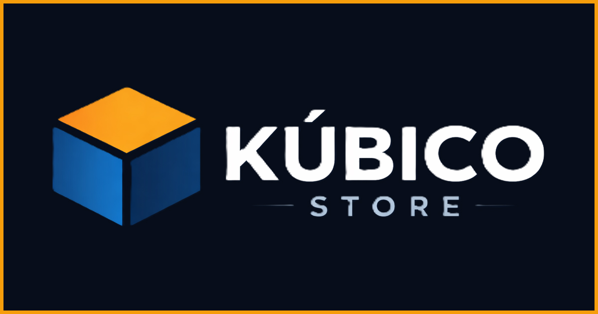

# Kúbico Store 🧊



> **Live Demo:** [Clique aqui para acessar o projeto online](https://kubicostore.vercel.app/)

## 💻 Sobre o Projeto

A **Kúbico Store** é uma *Single Page Application* (SPA) desenvolvida para um e-commerce de nicho, focado em Action Figures, Decoração Geek e Serviços de Impressão 3D.

O objetivo principal deste projeto foi desenvolver uma interface **Mobile-First**, altamente performática e com navegação fluida, utilizando o ecossistema React para gerenciar o estado da aplicação e as rotas de produtos dinamicamente.

Este projeto faz parte do portfólio da agência **Rosolen Digital**.

## 🚀 Tecnologias Utilizadas

O projeto foi desenvolvido utilizando as seguintes tecnologias:

-   **React.js:** Construção da interface baseada em componentes.
-   **React Router Dom:** Gerenciamento de rotas dinâmicas (`/produto/:id`) e navegação SPA (sem recarregamento).
-   **JavaScript (ES6+):** Lógica de manipulação de dados e arrays de produtos.
-   **CSS 3 / CSS Modules:** Estilização responsiva e layout (Flexbox & Grid).
-   **Vite:** Build tool para otimização e performance.

## ✨ Funcionalidades

-   🛒 **Catálogo de Produtos:** Renderização dinâmica baseada em dados (Array de Objetos).
-   📱 **Totalmente Responsivo:** Layout adaptável para Mobile, Tablet e Desktop.
-   🔗 **Rotas Dinâmicas:** Página de detalhes única que carrega as informações com base no ID do produto URL.
-   💬 **Integração WhatsApp:** Botão de "Comprar" que gera um link direto para o WhatsApp com mensagem personalizada do produto escolhido.
-   🔍 **SEO Otimizado:** Meta tags configuradas para melhor indexação e compartilhamento em redes sociais (Open Graph).

## 📦 Como rodar o projeto localmente

Pré-requisitos: Node.js instalado.

```bash
# 1. Clone o repositório
git clone [https://github.com/seu-usuario/kubico-store.git](https://github.com/seu-usuario/kubico-store.git)

# 2. Entre na pasta do projeto
cd kubico-store

# 3. Instale as dependências
npm install

# 4. Rode o servidor de desenvolvimento
npm run dev
```

🎨 Layout
O design segue uma estética Dark/Geek, utilizando tons de cinza escuro (Slate) para o fundo e laranja vibrante para os Call-to-Actions (CTAs), garantindo contraste e foco na conversão.

👨‍💻 Autor
Desenvolvido por Wellington.

Projeto desenvolvido com 💙 e React.
